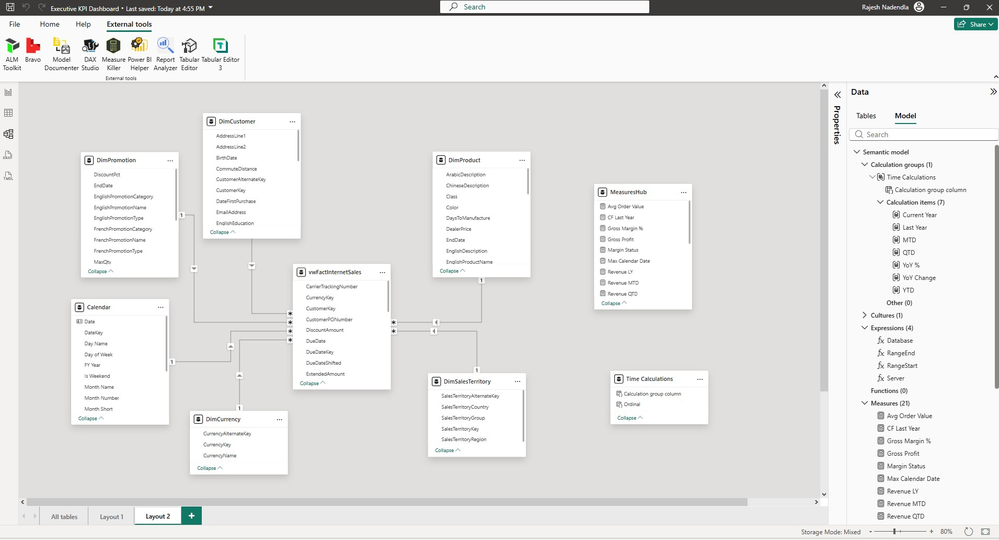
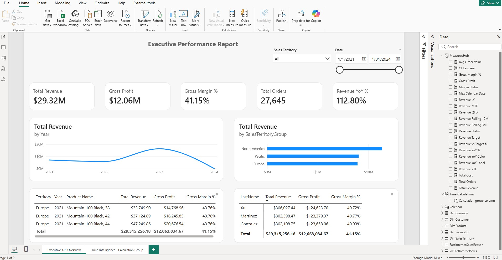
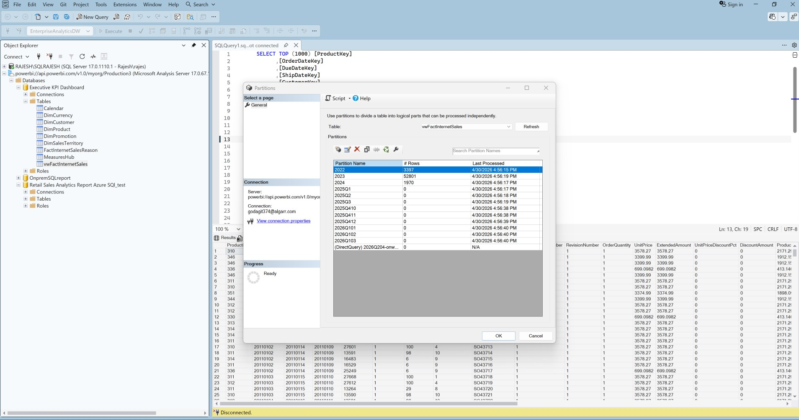

# Executive-KPI-Dashboard
A dashboard for tracking executive KPIs.

## Overview
This project demonstrates an executive-level KPI dashboard built using Power BI with real-world data modeling techniques.

## Key Features
- Dynamic Row-Level Security (RLS)
- Incremental Refresh for large datasets
- Time Intelligence using Calculation Groups
- Interactive KPI tracking and drill-down analysis

## Data Source
- On-prem SQL Server (AdventureWorksDW2025)

## Powerbi PBIX file

## Screenshots

## Architecture
- Star schema data model
- Fact + Dimension tables
- Optimized relationships

## Tools Used
- Power BI Desktop
- SQL Server
- DAX
- Power Query

## How to Use
1. Download the PBIX file from '/pbix'
2. Open in Power BI Desktop
3. Update data source if needed

## Author
Rajesh Nadendla
